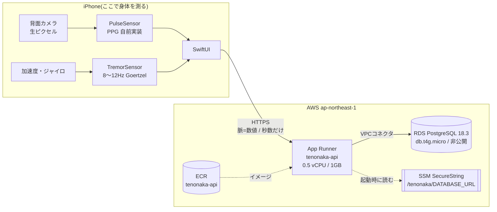

# 波びん

**生きた手に握られている間だけ、文字が現れる手紙。**

置くと止まる。飛ばせない。要約できない。
送り主に返るのは内容への返信ではなく、生きた手がその手紙を握っていた時間だけ。

ハッカソンテーマ **「AIにできないこと」** への回答。
設計の考え方は [docs/要件定義書.md](docs/要件定義書.md) に書いた。

## テーマへの立脚点

「AIのほうが下手なこと」を探すと必ず来年には追い抜かれる。
だから **構造的に不可能なこと** を機構に組み込んだ。

判定に使った問いはこれ。

> **このアプリを、AIエージェントは使えるか?**

答えは **使えない**。埋めるフォームがあるかどうかではなく、
送信と読解の両方が**身体の状態**を要求するため。

| 行為 | 要求されるもの | AIに無いもの |
|---|---|---|
| 送る | 指を当てて脈が測れること | 脈 |
| 読む | 端末を握り続けること | 手 |

いずれも**信号処理だけ**で実装している。HealthKit も CoreML も LLM も使っていない
(心拍数すら、カメラの生のピクセルから自分で計算している)。

## 体験の流れ

1. 便りを書く。**宛名も署名もない**(宛先の無い海に流すので要らず、
   名乗らないことがこの海の匿名性そのもの)
2. **背面カメラのレンズに指を当てる。** 脈が2秒安定すると封が押され、その拍数が刻まれる
3. 瓶に入って海へ流れていく
4. 海に浮かぶ瓶をタップしてひらく。ただし **一通も流していない人はひらけない**
5. **手に持っている間だけ**毎秒10文字ずつ文字が現れる。
   机に置くと止まり、拾い上げると再開する
6. 読み終えたら、今度は自分の脈で封をして返す
7. 流した人に返るのは **流した脈 → 読んだ脈**、握っていた秒数、置かれた回数

まだ現れていない文字は**描画していない**ので、先を覗くこともスクリーンショットで
先取りすることもできない。便りの長さも分からないので、残りを推し量れない。

## 評価項目への回答

### アーキテクチャを説明できるか



要点は3つ。

**身体の測定はすべて端末で完結する。** カメラの映像も加速度の生データも
一切サーバーへ送らない。上がるのは `senderBpm: 74` のような**数値と秒数だけ**。
外部の推論APIも、HealthKit も、CoreML も経路に存在しない。

**サーバーは薄い。** NestJS が公開しているのは7本の口だけで、
流す・拾う・海の通数・控えの一覧・符号での取得・読了報告に限られる。
状態は全部 PostgreSQL にあり、アプリ側に本文を保存しない
(**拾った便りも手元に持たない**ので、読み直しにも握る動作が必要になる)。

**信頼境界を正直に書くと、握る仕掛けはサーバーが守っていない。** 文字が現れる判定は
端末側にある。改造した端末なら本文を一度に取れる。これは**体験の機構であって
認可の境界ではない**。認可の境界に置いているのは「一通流さないと拾えない」
「拾った便りは一人にしか渡らない」の2つで、こちらはDBの更新で担保している。

### なぜこのアーキテクチャなのか

**決め手は「独自ドメインを持たずに有効な HTTPS を得たい」だった。** 会場で他人の端末に
入れて動かすので、証明書の警告が出る構成は使えない。

| 案 | 却下・採用の理由 |
|---|---|
| **App Runner**(採用) | `https://<id>.awsapprunner.com` が最初から有効。**同じ Dockerfile がローカルでも本番でも動く**。最小1インスタンスでコールドスタートも無い |
| Lambda + API Gateway | HTTPS は得られる。ただし Prisma の初期化がコールドスタートに乗り、VPC接続で更に伸びる。RDSへの接続数を抑えるには RDS Proxy(月額増)が要る。**コンテナが既にあるのに載せ替える理由が無かった** |
| ECS Fargate + ALB | ALB に HTTPS を付けるには ACM 証明書=**自前ドメインが必要** |
| EC2 | TLS を自分で運用することになる。ハッカソンで払う手間ではない |
| Elastic Beanstalk | 既定のエンドポイントは HTTP。HTTPS はやはり ACM+ドメイン |

DBを RDS にしたのは、**「一人にしか渡らない」を1本のUPDATEで担保したかった**から。
`updateMany` の条件に「まだ誰にも拾われていない」を入れ、更新件数が0なら競り負けたと
判断している。楽観ロックで済むので、追加の仕組みが要らない。

### 可用性が考えられているか

**やっていること**

| | |
|---|---|
| ヘルスチェック | `GET /health` を10秒間隔。5回続けて落ちたら App Runner が入れ替える |
| 自動増減 | 1〜25インスタンス、1台あたり同時100リクエスト。会場で一斉に触られても伸びる |
| コールドスタート | 最小1台なので無い |
| デプロイ | ローリング。ヘルスチェックが通らなければ自動で戻る |
| DBの隔離 | 非公開。App Runner のセキュリティグループ参照で 5432 のみ許可。公開IPを持たない |
| 秘密の置き場 | SSM SecureString。**App Runner の環境変数には置かない**(`describe-service` で誰でも平文で読めるため) |
| 流量制限 | 60リクエスト/分 |
| 入力の上限 | 本文20,000字、脈は25〜220の範囲外を拒否 |

**やっていないこと(意図して払っていない代償)**

- **RDS は単一AZ、バックアップ保持0日。** インスタンスが壊れたらデータは戻らない。
  保持を7日にするのは**追加費用がほぼ無い**(割り当て容量までのバックアップは無料)ので、
  デモ後に上げる価値がある。Multi-AZ は月18ドル増えるため、この規模では払っていない
- 監視・警報を置いていない。CloudWatch のログは出るが、通知はしていない
- Performance Insights は切っている

### コストが考えられているか

東京リージョンの実単価(AWS Pricing API から取得)で計算した月額。

| 項目 | 単価 | 月額(730時間) |
|---|---|---|
| App Runner メモリ 1GB | $0.00885 / GB-時 | **$6.46** |
| App Runner vCPU 0.5 | $0.0809 / vCPU-時(**処理中のみ**) | $0〜1 |
| RDS db.t4g.micro | $0.025 / 時 | **$18.25** |
| RDS gp3 20GB | $0.138 / GB-月 | **$2.76** |
| ECR・SSM・VPCコネクタ | — | ほぼ0 |
| | | **合計 約28ドル/月** |

**削るために決めたこと**

- **自動デプロイを切っている。** App Runner の自動デプロイは**1パイプラインあたり月1ドル**の
  固定費がかかる。手動で `start-deployment` を叩けば済むので払っていない
  (同時に、意図しないデプロイを防ぐ効果もある)
- 実行構成は最小の 0.5 vCPU / 1GB。**vCPU は処理中しか課金されない**ので、
  待っているだけの時間はメモリ代だけになる
- Multi-AZ と Performance Insights を切って、月18ドルと監視費用を払っていない
- ストレージは最小の20GB。本文20,000字上限でも、数万通で埋まらない

**構造上ゼロにできない部分**は RDS の18ドルで、ここが月額の6割を占める。
常時起動が不要なら Aurora Serverless v2 や RDS の停止(最大7日)で下げられるが、
**最小 0.5 ACU でも t4g.micro より高い**ため、この規模では素の t4g.micro が最も安い。

### 新規性

**「AIが下手なこと」ではなく「AIに構造的に不可能なこと」を関門にした。** 判定に使った
問いは *このアプリを、AIエージェントは使えるか*。答えは使えない。フォームの有無ではなく、
**送信と読解の両方が身体の状態を要求する**ためである。

- 心拍を既製のAPIに頼らず、**カメラの赤チャンネルの平均値から自分で計算している**
  (移動平均の帯域通過 → 不応期つきピーク検出 → IBIの中央値)
- 握られているかを、**生理的微動 8〜12Hz を Goertzel 法で1秒窓ごとに検出**して判定している。
  置いた机の上では出ない周波数帯を選んでいる
- 返信が**言葉ではなく身体の事実だけ**(流した脈 → 読んだ脈、握っていた秒数、置かれた回数)

### 面白さ

- **海に浮かぶ瓶をタップして拾う。** 「拾う」ボタンを押すのではなく、漂っているものに手を伸ばす
- **一通流さないと拾えない。** 読みたければ書くことになる。受け取るだけの海にしていない
- **持ち続けないと読めない緊張。** 置くと止まる。誰かの告白を途中で置くと、それが相手に伝わる
- 流すときは瓶が波の向こうへ消え、拾うときは波の向こうから流れてきて栓が抜ける

### 斬新さ

**要約できない手紙。** 全文取得もスキップも先読みも、機構として禁じている。

- まだ現れていない文字は**描画していない**。スクリーンショットでも先取りできない
- 便りの長さを見せない。あと何行あるか推し量れない
- 拾った便りの本文を**端末に保存しない**。読み直すときもサーバーから取り直すので、
  もう一度握らなければならない
- AIに要約させることを前提にした時代に、**要約されたくない言葉の置き場**を作っている

## 計測の仕組み

### 脈 — 光電容積脈波 (PPG)

[`PulseSensor.swift`](ios/Tenonaka/Data/PulseSensor.swift)

指の腹をレンズに当てると、指を透過した光がセンサに届く。心臓が血を送るたびに
毛細血管の血液量が変わり、**画像の赤成分の平均**が心拍に合わせて上下する。

1. 毎フレーム、中央 ROI の赤成分の平均を取る
2. 移動平均を引いて明るさのドリフトを除去(ハイパス)
3. 短い移動平均でノイズを潰す(ローパス)
4. 不応期 0.30 秒を設けて山を検出
5. 拍間隔の**中央値**から心拍数を出す(平均だと1つの誤検出でずれる)

**露出とホワイトバランスを固定**するのが要点。自動のままだとカメラが血液量の変化を
「明るさのブレ」として補正で打ち消してしまい、波形が出ない。

当て方の失敗は原因を判別して指示を返す。誰に渡しても数秒で当てられるように。

| 状態 | 表示 |
|---|---|
| 覆えていない | 背面のレンズを指の腹で覆う |
| 外光が漏れている | レンズ全体を隙間なく覆う |
| **押しつけすぎ**(血流が止まって波形が平坦) | 力を抜いて、そっと触れるだけ |
| 拍がばらついている | 動かさずに待つ |
| 光量不足 | 明るい場所で試す |

ライトは**既定で消灯**。環境光で足りないと2秒判定してから、やむなく弱く点ける。

### 微動 — 生理的微動 (8〜12Hz)

[`TremorSensor.swift`](ios/Tenonaka/Data/TremorSensor.swift)

人間の手には常に 8〜12Hz の細かい震えがある。運動単位の発火に由来する不随意なもので、
止めようとしても止まらない。机に置いた端末には存在しない。

加速度と角速度を 100Hz で取り、1秒窓にハン窓をかけて **Goertzel 法**で
8〜12Hz の各周波数だけを直接計算する(FFT を持ち出すほどの帯域数ではない)。

iPhone 15 での実測値:

| 条件 | 8〜12Hz の強さ | 「置く」比 |
|---|---|---|
| 手に持つ | 0.00352 | **23倍** |
| 机に肘をついて構える | 0.00184 | **12倍** |
| 持って歩く | 0.02512 | 167倍 |
| 机に置く | 0.00015 | — |

しきい値は **0.0013**。「置く」の8.7倍上、「机に構える」の1.4倍下。
離す判定だけ **1.5秒遅らせる**(持ち替えの一瞬で止めないため)。再開は即時。

当初は 0.0008 / 3秒遅延だったが、**置いたのに文字が出続ける**のが体感に出たため厳しくした。
これ以上上げると「机に肘をついて構える」= 正当な読み方が止まりはじめる。

遅延を非対称にしているのは、持ち替えの一瞬で文字が止まると体験が壊れる一方、
再開は即時でよいため。端末ごとに詰めたいときは `TREMOR_TEST=1` の画面にスライダがある。

## 構成

```
tenonaka/
├── docker-compose.yml          ローカル用 PostgreSQL (ポート 5433)
├── server/                     NestJS + Prisma
│   ├── Dockerfile              マルチステージ。App Runner にそのまま載る
│   ├── prisma/schema.prisma
│   ├── prisma/migrations/
│   └── src/letters/            手紙・封印・読了報告
└── ios/                        Swift / SwiftUI
    ├── Tenonaka.xcodeproj
    ├── Supporting/Info.plist
    └── Tenonaka/
        ├── Models/Letter.swift
        ├── Data/               PulseSensor, TremorSensor, LetterStore
        ├── Theme/              紙の質感・明朝体
        └── Views/              書く・封をする・読む
```

## 動かし方

### ローカル

```bash
docker compose up -d
cd server
npm install
cp .env.example .env
npx prisma migrate deploy
npm run dev                      # http://localhost:3100
```

```bash
open ios/Tenonaka.xcodeproj
```

**脈と微動はシミュレータでは測れません**(カメラも加速度センサも無い)。実機が必要。

### 実機

署名は自動署名。Apple の Team ID はリポジトリに含めていないので、初回だけ用意する。

```bash
cp ios/Supporting/Signing.local.example.xcconfig ios/Supporting/Signing.local.xcconfig
# 自分の Team ID を書く。確認方法はファイル内のコメント参照
```

このファイルは git 管理外で、任意インクルードなので**無くてもシミュレータ向けビルドは通る**。

iOS 16 以降は **デベロッパモード** が必要:
設定 → プライバシーとセキュリティ → デベロッパモード → オン → 再起動。
項目が見えないときは、一度 Xcode から実行を試みると現れる。

```bash
cd ios
xcodebuild -project Tenonaka.xcodeproj -scheme Tenonaka \
  -destination 'id=<DEVICE_UDID>' -configuration Debug \
  TENONAKA_API_BASE_URL="https://<your-service>.awsapprunner.com" \
  -allowProvisioningUpdates build

xcrun devicectl device install app --device <DEVICE_ID> <APP_PATH>
```

`xcrun devicectl list devices` で `<DEVICE_ID>` を、
`xcrun xctrace list devices` で `<DEVICE_UDID>` を確認できる。

接続先はビルド設定 `TENONAKA_API_BASE_URL` が既定値になる。
**ホーム画面のタイトル「波びん」を長押し**すると実行中に差し替えられる
(会場で接続先が変わったとき用の逃げ道)。

## 本番環境 (AWS)

| | |
|---|---|
| API | App Runner が発行する `https://<id>.<region>.awsapprunner.com` |
| 実行 | App Runner `tenonaka-api` (0.5 vCPU / 1GB) |
| DB | RDS PostgreSQL 18.3 `tenonaka-db` db.t4g.micro / gp3 20GB(非公開・単一AZ) |
| 経路 | App Runner → VPC コネクタ → RDS。SG 参照で 5432 のみ許可 |
| 接続情報 | SSM パラメータストア `/tenonaka/DATABASE_URL` (SecureString) |
| リージョン | ap-northeast-1 |

**App Runner を選んだ理由は HTTPS。** 詳しい比較は
[評価項目への回答](#なぜこのアーキテクチャなのか) に書いた。
ALB や Elastic Beanstalk は ACM 証明書=自前ドメインが必要になる。
Lambda + API Gateway なら HTTPS は得られるが、Prisma のコールドスタートと
RDS への接続数の問題を抱えることになる。常時起動なのでコールドスタートも無い。

### 更新手順

```bash
source ~/.tenonaka-deploy.env
cd server
docker buildx build --platform linux/amd64 --provenance=false --sbom=false \
  -t ${ACCOUNT}.dkr.ecr.${AWS_REGION}.amazonaws.com/tenonaka-api:latest --push .
aws apprunner start-deployment --service-arn "$SERVICE_ARN"
```

`--provenance=false --sbom=false` は**毎回必要**。付けないと buildx が
OCI image index (マニフェストリスト) を作り、**App Runner が pull できない**。

`--platform linux/amd64` も必須(App Runner は x86_64、開発機は arm64)。

起動時に `prisma migrate deploy` が走る。

### DB の接続情報

**App Runner の環境変数には置かない。** 環境変数は `describe-service` で誰でも読めるため、
共有アカウントではパスワードが平文で露出する。

SSM パラメータストアの SecureString に置き、`RuntimeEnvironmentSecrets` から参照している。
そのためにインスタンスロール(信頼先 `tasks.apprunner.amazonaws.com`)が必要で、
ECR プル用のロールとは別物である。

権限は [`scripts/deploy/instance-role-policy.json`](scripts/deploy/instance-role-policy.json) の通り
最小限に絞っている。`ACCOUNT` と `REGION` は自分の値に置き換えて使う。

```bash
sed -e "s/ACCOUNT/${ACCOUNT}/g" -e "s/REGION/${AWS_REGION}/g" \
  scripts/deploy/instance-role-policy.json > /tmp/instance-role-policy.json
aws iam put-role-policy --role-name tenonaka-apprunner-instance-role \
  --policy-name read-tenonaka-parameters \
  --policy-document file:///tmp/instance-role-policy.json
```

- `ssm:GetParameter` は `/tenonaka/*` のみ(他プロジェクトのパラメータは読めない)
- `kms:Decrypt` は `kms:ViaService = ssm.ap-northeast-1.amazonaws.com` の条件付き
  (SSM 経由以外では復号できない)

パスワードを入れ替えるときは、**先に SSM を更新してから** RDS を変更する。
逆順だと接続できない時間が長くなる。

```bash
NEW_PASSWORD=$(openssl rand -base64 24 | tr -d '/+=@" ' | cut -c1-24)
aws ssm put-parameter --name /tenonaka/DATABASE_URL --type SecureString --overwrite \
  --value "postgresql://tenonaka:${NEW_PASSWORD}@<endpoint>:5432/tenonaka?schema=public"
aws rds modify-db-instance --db-instance-identifier tenonaka-db \
  --master-user-password "$NEW_PASSWORD" --apply-immediately
aws apprunner start-deployment --service-arn "$SERVICE_ARN"
```

### 構築時に踏んだ落とし穴

- **App Runner は `apne1-az3` に対応していない。** VPC コネクタのサブネットは
  `ap-northeast-1c` (apne1-az1) と `1d` (apne1-az2) を使う。論理AZ名ではなく物理AZで判断する
- **`AWSServiceRoleForAppRunner` は自動作成されない。** VPC コネクタ作成時に
  ネットワーク用のロールだけが作られるので、本体用は `create-service-linked-role` で明示的に作る
- **zsh では `$ACCOUNT:role/...` が壊れる。** `:r` がパラメータ修飾子として解釈されるため
  `${ACCOUNT}` と囲む必要がある

## API

認証は `x-user-id` ヘッダのみ(未指定なら `local-user`)。
端末ごとに UUID を発行して送っている。レート制限は 60回/分。

| メソッド | パス | 内容 |
|---|---|---|
| POST | `/letters` | 海に流す。**`senderBpm` は必須**(脈が無いと流せない) |
| POST | `/letters/pickup` | 海から一通拾う。**流した実績が無ければ拒否** |
| GET | `/letters/sea` | 海の通数と、自分が拾える数 |
| GET | `/letters/sent` | 流した便りと、その読まれ方 |
| GET | `/letters/received` | 拾った便りの控え。**本文を返さない** |
| GET | `/letters/:code` | 符号で本文を取る(読み直し用) |
| POST | `/letters/:code/receipt` | 読まれ方を返す。拾った端末からのみ |
| GET | `/health` | 死活確認 |

**`/letters/received` が本文を返さない**のが要点。手元に全文が残ると、
握らないと読めないという機構が読み直しで崩れる。棚から開くときも本文は取り直す。

読了報告は**上書きではなく、より長く握られた記録が残る**。読み直しで時間が減らないように。

### 一人にしか渡らない

拾われた便りは海から消え、**他の誰にも渡らない**。これを担保しているのは
条件つきの UPDATE 一本である。

```
UPDATE Letter
   SET claimedByUserId = :me, claimedAt = now()
 WHERE id = :選んだ便り
   AND claimedByUserId IS NULL      -- ここが要点
```

更新件数が 0 なら先を越されたと判断してやり直す。楽観ロックで済むので、
キューや排他の仕組みを足す必要がない。
**「同時に2人が同じ瓶を拾ったらどうなるか」への答えがこの1行である。**

- 拾った本人の読み直しは許す(一度しか読めない、ではなく一人しか読めない)
- 読了報告も拾った端末からのみ(符号を知っているだけでは偽造できない)

### 相互性はサーバーで確かめる

**一通も流していない人は拾えない。** 「流した数 > 拾った数」をサーバー側で数えて拒否する。
ボタンを押せるかどうかの判定をクライアントに任せていない。

受け取るだけの海にしないための制約で、**読みたければ書くことになる**という動機も生む。

### 符号は「言える言葉」にする

符号は当初、**声に出して相手に渡すもの**だった。海に流す形に変えて渡す相手がいなくなり、
UIからは消えたが、読み直しの鍵として残っている。人がログや障害対応で扱う値なので、
読める形を保っている。

```
GONOHOHOBU   REZEHUGAPE   YUZADATAZE   MISUHABOGI
```

仮名の音節(`KA` `SU` `HO` …58種)を5つ並べた10文字。日本語話者はそのまま読める。
ランダムな英数字だと `2UJECG` のようになり、「にーゆーじぇいいーしーじー」では人が扱えない。

- **数字を使わない。** `I` と `1`、`O` と `0` の見間違いが構造的に起きない
- 58<sup>5</sup> = **約6億5000万通り**
- 生成には `crypto.randomInt` を使う(符号は読み直しの鍵として機能するので、
  予測可能な `Math.random()` は使えない)
- `code` を指定して作ることもできる(5〜12文字の英字。`SAKURA` `KOMOREBI` など)

### 守りの水準について

**本物の認証ではない。** 端末が発行した UUID を `x-user-id` としてそのまま渡しており、
推測できない文字列をベアラトークンとして使っているだけである。

- 既定値は持たせていない(以前は `local-user` に落としており、推測できる ID で
  他人の送信履歴が全部見えていた)
- 脈は個人識別に使えないので、**誰が読んだかは証明できない**。
  証明できるのは「生きた身体がその瞬間そこに居たこと」まで

## 海に種を入れる

**海が空だと「拾う」が成立しない。** 便りは一人しか拾えないので、
試すたびに減る。デモの前に補充する。

```bash
./scripts/seed-sea.sh                                          # ローカルの海へ
BASE_URL=https://<your-service>.awsapprunner.com ./scripts/seed-sea.sh   # 本番の海へ
RESET=1 ./scripts/seed-sea.sh                                  # ローカルを空にしてから入れる
```

本文は [`scripts/sea-letters/`](scripts/sea-letters/) の `*.txt` を1通ずつ読む。
脈は便りごとに散らしてある(同じ数字が並ぶと作り物に見えるため)。
署名も宛名も付けない — **アプリから書けないものを種だけが持つのは不整合**なので。

## 動作確認用の起動フラグ (Debug ビルドのみ)

```bash
xcrun devicectl device process launch --device <DEVICE_ID> --terminate-existing \
  --environment-variables '{"LETTER":"1"}' dev.takao.namibin
```

| 環境変数 | 内容 |
|---|---|
| `LETTER=1` | サンプルの便りを読む画面だけを出す |
| `COMPOSE=1` | 書く画面を、文字を入れた状態で開く(罫線との噛み合わせを見る) |
| `SHELF=1` | 棚だけを出す |
| `CAST_ANIM=1` | 流す演出だけを出す(カメラが要らないので simulator で見られる) |
| `PICKUP_ANIM=1` | 拾って開ける演出だけを出す |
| `PULSE_TEST=1` | 脈の検証画面(波形・心拍数・当て方の指示・明るさ) |
| `TREMOR_TEST=1` | 微動の検証画面(帯域エネルギー・しきい値スライダ) |
| `REVEAL_ALL=1` | 握らなくても文字を現す(simulator に加速度センサが無いため) |
| `AUTO_CAST=1` | 脈を測らずに封をして流すところまで自動で進める |

シミュレータの場合は `SIMCTL_CHILD_` 接頭辞をつけて `xcrun simctl launch` に渡す。

```bash
SIMCTL_CHILD_PICKUP_ANIM=1 xcrun simctl launch booted dev.takao.namibin
```

`REVEAL_ALL` と `AUTO_CAST` は**関門を迂回する**ので、Debug ビルドの中だけに閉じてある
(Release では常に無効)。

## 正直な限界

- **これは DRM ではない。** 別の端末で撮影して要約させることは可能で、技術的に防げない。
  この機構が保証するのは「防止」ではなく **「費やされたかどうかの申告」**
- **なりすましは防げない。** 脈は個人識別に使えない(常に変動し、他人と重なる)。
  証明できるのは「生きた身体がその瞬間そこに居たこと」までで、それが誰かは分からない
- **医療的な精度は主張しない。** 心拍数は妥当な値が出ることを確認しただけで、
  正解と突き合わせた検証はしていない
- 微動の判定はバイブレーターで偽装しうる。脈より弱い証明である
